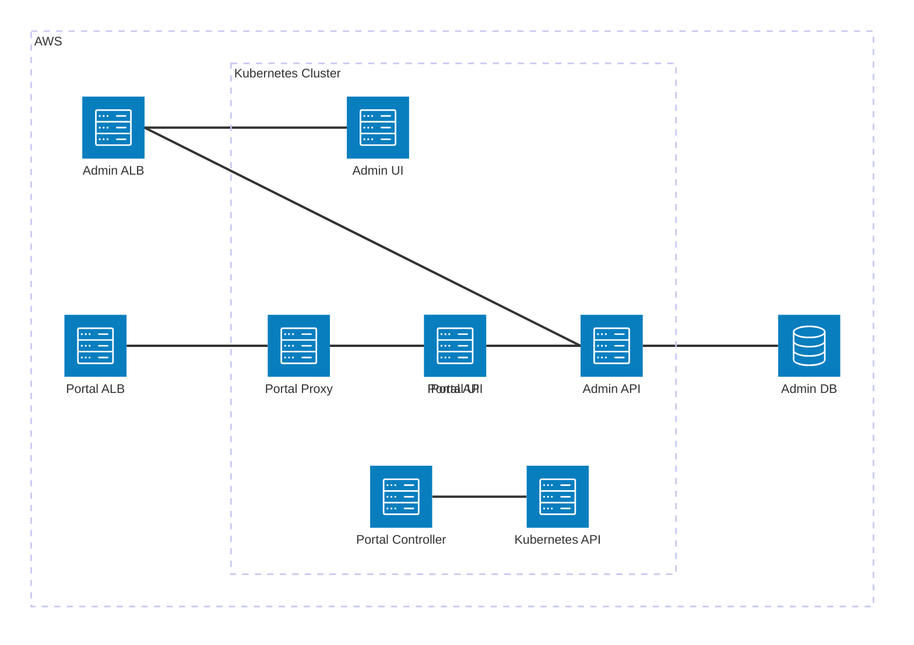

# インフラアーキテクチャ図

以下は､Kubernetesクラスタと各種AWSサービスを利用するEditionのTACOKUMOを想定した､インフラアーキテクチャ図です｡

Admin用ALBおよびPortal用ALBは､OIDC認証を利用することを強く推奨しています｡

```mermaid
architecture-beta
    group AWS[AWS]

    service admin_alb(server)[Admin ALB] in AWS
    service admin_db(database)[Admin DB] in AWS

    group k8s[Kubernetes Cluster] in AWS
    service apiserver(server)[Kubernetes API] in k8s

    service admin_api(server)[Admin API] in k8s
    service admin_ui(server)[Admin UI] in k8s

    admin_alb:R -- L:admin_api
    admin_alb:R -- L:admin_ui
    admin_api:R -- L:admin_db


    service portal1_api(server)[Portal API] in k8s
    service portal1_ui(server)[Portal UI] in k8s

    service portal_controller(server)[Portal Controller] in k8s
    portal_controller:R -- L:apiserver

    portal1_api:R -- L:admin_api

    service portal_alb(server)[Portal ALB] in AWS
    service portal_proxy(server)[Portal Proxy] in k8s 

    portal_alb:R -- L:portal_proxy
    portal_proxy:R -- L:portal1_api
    portal_proxy:R -- L:portal1_ui
```