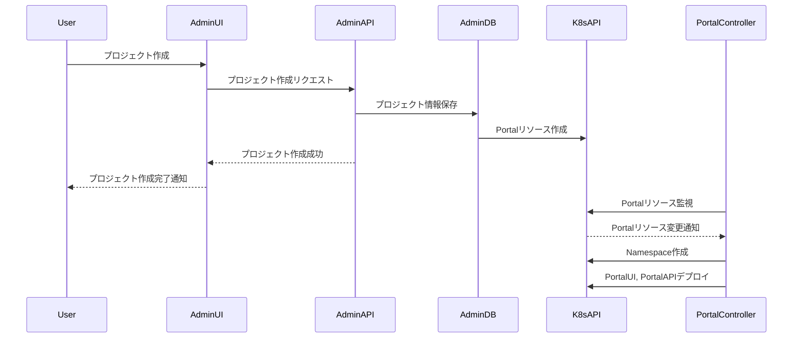

# プロジェクト作成

## シーケンス図

```mermaid
sequenceDiagram
    User->>AdminUI: プロジェクト作成
    AdminUI->>AdminAPI: プロジェクト作成リクエスト
    AdminAPI->>AdminDB: プロジェクト情報保存
    AdminDB->>K8sAPI: Portalリソース作成
    AdminAPI-->>AdminUI: プロジェクト作成成功
    AdminUI-->>User: プロジェクト作成完了通知

    PortalController->>K8sAPI: Portalリソース監視
    K8sAPI-->>PortalController: Portalリソース変更通知
    PortalController->>K8sAPI: Namespace作成
    PortalController->>K8sAPI: PortalUI, PortalAPIデプロイ
```